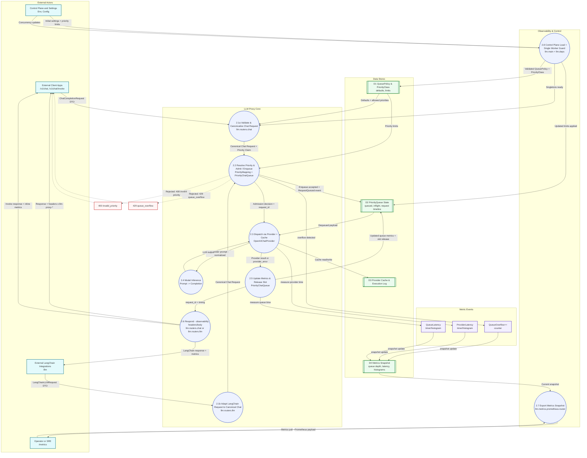

```mermaid
flowchart TD
%% Gane–Sarson style DFD (Level 2) — LLM Proxy Core: Priority Admission + Execution Tracking

classDef ext stroke:#0b7285,fill:#e3fafc,stroke-width:2px;
classDef proc stroke:#364fc7,fill:#edf2ff,stroke-width:2px;
classDef store stroke:#2b8a3e,fill:#ebfbee,stroke-width:2px;
classDef evt stroke:#5f3dc4,fill:#f3f0ff,stroke-width:2px;
classDef rej stroke:#c92a2a,fill:#fff5f5,stroke-width:2px;

subgraph EXT[External Actors]
direction TB
E1[External Client Apps\n/v1/chat, /v1/chat/invoke]:::ext
E2[External LangChain Integrations\n/llm]:::ext
E3[Operator or SRE\n/metrics]:::ext
E4[Control Plane and Settings\nEnv, Config]:::ext
end

subgraph CORE[LLM Proxy Core]
direction TB
P21a((2.1a Validate & Canonicalize Chat Request\nllm.routers.chat)):::proc
P21b((2.1b Adapt LangChain Request to Canonical Chat\nllm.routers.llm)):::proc
P22((2.2 Resolve Priority & Admit / Enqueue\nPriorityMapping + PriorityChatQueue)):::proc
P23((2.3 Dispatch via Provider + Cache\nOpenAIChatProvider)):::proc
P24((2.4 Model Inference\nPrompt -> Completion)):::proc
P25((2.5 Update Metrics & Release Slot\nPriorityChatQueue)):::proc
P26((2.6 Respond - observability headers/body\nllm.routers.chat or llm.routers.llm)):::proc
end

subgraph STORES[Data Stores]
direction TB
D1[[D1 QueuePolicy & PriorityClass\ndefaults, limits]]:::store
D2[[D2 PriorityQueue State\nqueued, inflight, request timeline]]:::store
D3[[D3 Provider Cache & Execution Log]]:::store
D4[[D4 Metrics Snapshot\nqueue depth, latency, histograms]]:::store
end

subgraph OBS[Observability & Control]
direction TB
P27((2.7 Export Metrics Snapshot\nllm.metrics.prometheus.router)):::proc
P28((2.8 Control Plane Load + Single Worker Guard\nllm.main + llm.deps)):::proc
end

subgraph EVENTS[Metric Events]
direction TB
EV_QO[QueueOverflow++\ncounter]:::evt
EV_PL[ProviderLatency\ntimer/histogram]:::evt
EV_QL[QueueLatency\ntimer/histogram]:::evt
end

E1 -->|ChatCompletionRequest DTO| P21a
E2 -->|LangChainLLMRequest DTO| P21b

P21a -->|Canonical Chat Request + Priority Claim| P22
P21b -->|Canonical Chat Request| P22

E4 -->|Initial settings + priority limits| P28
P28 -->|Validated QueuePolicy + PriorityClass| D1
P28 -->|Singletons ready| P21a

D1 -->|Defaults + allowed priorities| P21a
D1 -->|Priority limits| P22

P22 -.->|Rejected: 400 invalid priority| REJ400[400 invalid_priority]:::rej
P22 -.->|Rejected: 429 queue_overflow| REJ429[429 queue_overflow]:::rej
REJ400 -.-> E1
REJ429 -.-> E1

P22 -->|Enqueue accepted + RequestQueued event| D2
P22 -->|Admission decision + request_id| P23

D2 -->|Dequeued payload| P23
P23 -->|Provider prompt - normalized| P24
P24 -->|LLM output| P23

P23 -->|Cache read/write| D3
P23 -->|Provider result or provider_error| P25

P25 -->|Updated queue metrics + slot release| D2
P25 -->|request_id + timing| P26

P26 -->|Response + headers x-llm-proxy-*| E1
P26 -->|Invoke response + inline metrics| E1
P26 -->|LangChain response + metrics| E2

E3 -->|Metrics pull| P27
D4 -->|Current snapshot| P27
P27 -->|Prometheus payload| E3

E4 -->|Concurrency updates| P28
P28 -->|Updated limits applied| D2

P22 -->|overflow detected| EV_QO
P23 -->|measure provider time| EV_PL
P25 -->|measure queue time| EV_QL
EV_QO -->|snapshot update| D4
EV_PL -->|snapshot update| D4
EV_QL -->|snapshot update| D4
```
